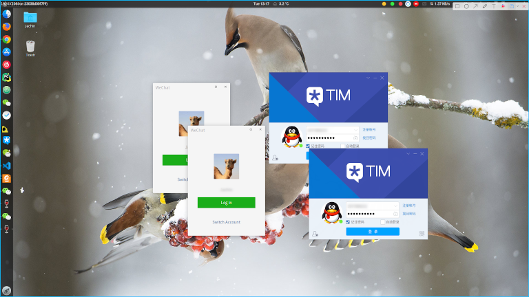

# ubuntu qq/微信

Ubuntu qq&微信安装/启动脚本。

## 1. Docker

本脚本依赖Docker，需要提前安装好Docker环境。参考<https://yeasy.gitbooks.io/docker_practice/install/ubuntu.html>安装

Ubuntu 19.10简化安装：

```sh
sudo apt update
sudo apt install docker.io -y
sudo usermod -aG docker $USER
```

安装完成需要退出当前终端并重新登录。

## 2. 安装

```sh
#Install qq
bash <(curl -L -s https://raw.githubusercontent.com/ygcaicn/ubuntu_qq/master/qq.sh)

#Install wechat
bash <(curl -L -s https://raw.githubusercontent.com/ygcaicn/ubuntu_qq/master/wechat.sh)
```

## 3. 使用

安装完成后第一次运行需要下载镜像，通常需要几分钟！

```sh
qq -h
qq [-h] [-i] [-f] [-c] [--start|start] [-t|--tag Tag] [--remove] [--instance]
  -h, --help            Show help
  -i, --install         Install this script to system
  -f, --force           Force install or reinstall
  -c, --clean           Clean all qq container
  -t, --tag Tag         Explicit docker tag, office is default
                        im(QQ), office(TIM), eim(EIM), light(QQ Light)
      --start           Start qq
      --update          Update script
      --remove          Remove this script
      --instance        Create a instance qq container, you can create more then one using this option

wechat -h
wechat [-h] [-i] [-f] [-c] [--start|start] [--remove] [--instance]
  -h, --help            Show help
  -i, --install         Install this script to system
  -f, --force           Force install or reinstall
  -c, --clean           Clean all wechat container
      --start           Start wechat
      --update          Update script
      --remove          Remove this script
      --instance        Create a instance wechat container, you can create more than one using this option
```

自动创建启动图标，使用--instance选项可多开。可以复制粘贴发送文件。

配合插件[TopIcons Plus](https://extensions.gnome.org/extension/1031/topicons/)使用，体验更佳！



## 感谢

<https://github.com/bestwu/docker-qq>

<https://github.com/bestwu/docker-wechat>
